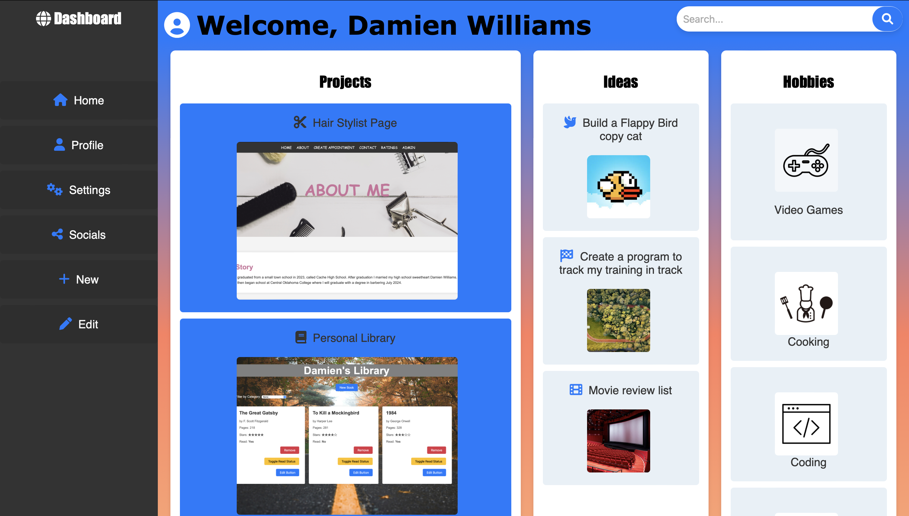
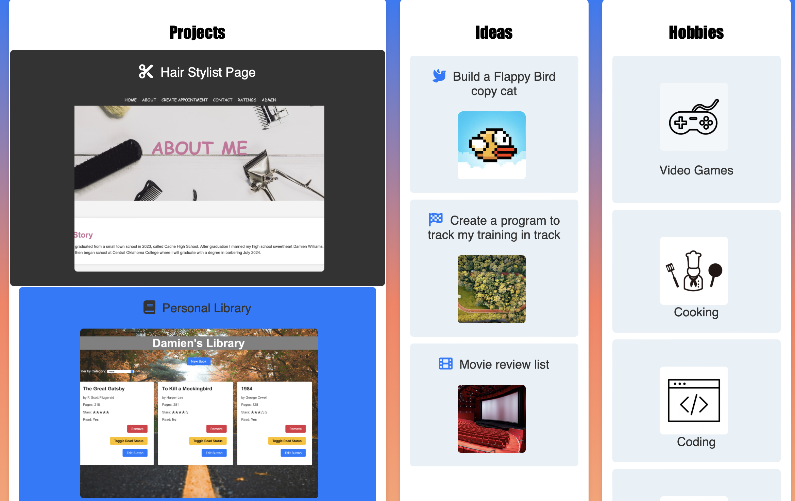

# **Admin-Odin**

## **Admin Project**
This project is part of the Intermediate HTML and CSS unit in the Odin Project under the "Grid" chapter. It is a simple admin dashboard that allows users to see their projects, hobbies, and ideas for the future. I take it as a way to look at everything I have done and hopefully after I complete the Odin project it will be improved and full of eveyrthing I have done all in one "admin page" that is really like a portfolio of myself to show in the future.

---

## **Application Screenshots**

### **Home Admin Page**  
  

### **Hover Feature**  
  

### **Search Bar Feature**  
  

---

## **Technologies Used**
- **HTML**: Provides the structure for the app.
- **CSS**: Styles and layouts for better user experience.

---

## **Features Implemented**

### **Core Requirements:**
- **Elements To Be Used:** sidebar, header and main-content containers.
- **Grid:** Grid properties to be used so I can produce a good layout.
- **Nesting:** Must nest elements in the dashboard.
- **Style:** Style the page with your choice of icons, pictures, fonts, etc.

### **Additional Features I Made:**
- **Icons:** I used many icosn to produce a user friendly and appealing to the eye content using font awesome that I lerned in a previous lesson.
- **Hover Effect:** I used some hovering effects and transition to showcase some css styling features I have used and learned during the project.
- **Borders and Images:** Showcased my ideas and skills with borders and images to make the webpage unique.
   

---

## **Usage Guidelines**
1. Open the application using my github pages link.
2. Hover over the webpage to see the different css styles like color changes.

---

## **Future Improvements Planned**
- **JavaScript Implementation:** To add logic to go to different pages and add or edit.
- **Improve CSS:** Make the page more appealing and cleaner
- **Search Bar:** Add js to the search bar.

---

## **Learning Outcomes**
- **CSS Style** Improved understanding of grids and css styling.
- **Nesting:** Gained experience in nesting elements in HTML.

